Markdown에서 Mermaid 다이어그램을 그리는 핵심은 **코드 블록의 언어 이름을 `mermaid`로 지정하고, 그 안에 Mermaid 문법을 작성하는 것**입니다. 다만 Markdown 자체가 그림을 만드는 것은 아니며, **GitHub, GitLab, VS Code 확장, Notion 등 해당 Markdown 뷰어가 Mermaid 렌더링을 지원해야** 실제 다이어그램으로 표시됩니다.

## 1. 가장 기본적인 작성 형태

Markdown 파일에 아래처럼 작성합니다.

````markdown
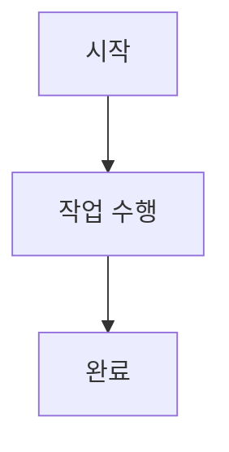
````

렌더링을 지원하는 환경에서는 다음 흐름도로 보입니다.


- 첫 줄의 `flowchart TD`는 다이어그램 종류와 방향을 정합니다.
- `TD`는 위에서 아래(Top Down) 방향입니다.
- `A`, `B`, `C`는 노드의 내부 식별자입니다.
- 대괄호 안의 `시작`, `작업 수행` 등은 화면에 표시되는 라벨입니다.
- `-->`는 화살표 연결입니다.

---

## 2. Markdown과 Mermaid의 관계

| 구분 | 역할 |
|---|---|
| Markdown | 제목, 본문, 목록, 표, 코드 블록 등을 작성하는 문서 형식 |
| Mermaid | 코드 형태의 텍스트로 다이어그램을 정의하는 문법 |
| Mermaid 지원 렌더러 | Mermaid 코드를 실제 그림으로 변환해 보여 주는 도구 또는 서비스 |

즉, Markdown 문서에 Mermaid 코드를 넣는다고 항상 그림이 보이는 것은 아닙니다.

- **렌더링 지원 환경**: 코드가 다이어그램으로 표시됨
- **미지원 환경**: 단순한 `mermaid` 코드 블록으로 표시됨

특히 문서 저장소, 위키, 블로그 플랫폼마다 지원 여부와 지원 Mermaid 버전이 다를 수 있습니다.

---

## 3. 흐름도: 가장 많이 사용하는 유형

업무 프로세스, 의사결정, 시스템 처리 절차를 그릴 때 적합합니다.

### 3-1. 방향


주요 방향은 다음과 같습니다.

| 선언 | 방향 |
|---|---|
| `flowchart TD` 또는 `flowchart TB` | 위 → 아래 |
| `flowchart LR` | 왼쪽 → 오른쪽 |
| `flowchart RL` | 오른쪽 → 왼쪽 |
| `flowchart BT` | 아래 → 위 |

문서 폭이 좁으면 `TD`, 프로세스 단계가 길고 가로 공간이 충분하면 `LR`이 읽기 좋은 경우가 많습니다.

### 3-2. 노드 모양

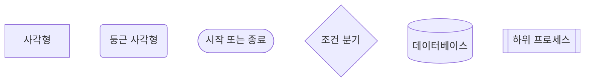

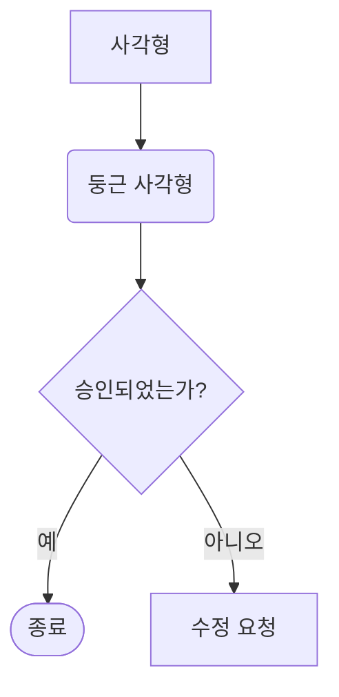

자주 쓰는 표기입니다.

| 문법 | 의미 또는 용도 |
|---|---|
| `A[텍스트]` | 일반 작업·처리 단계 |
| `A(텍스트)` | 둥근 노드 |
| `A([텍스트])` | 시작·종료 지점 |
| `A{텍스트}` | 조건 또는 의사결정 |
| `A[(텍스트)]` | 데이터 저장소·DB |
| `A[[텍스트]]` | 별도 프로세스·참조 작업 |

### 3-3. 연결선과 라벨

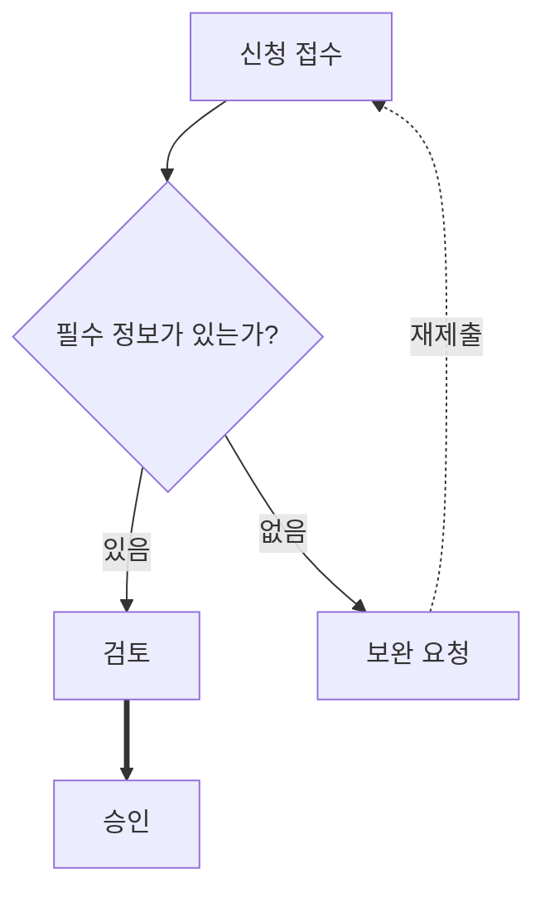

| 문법 | 뜻 |
|---|---|
| `A --> B` | 일반 화살표 |
| `A --- B` | 화살표 없는 연결 |
| `A -.-> B` | 점선 화살표 |
| `A ==> B` | 굵은 화살표 |
| `A -->|라벨| B` | 라벨이 있는 화살표 |

### 3-4. 그룹화: `subgraph`

시스템 경계, 담당 조직, 처리 단계 등을 나눌 때 사용합니다.

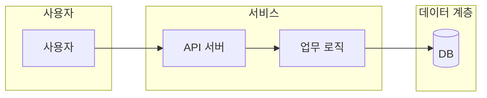

`subgraph`는 “사용자 영역”, “백엔드 영역”, “외부 시스템”처럼 책임 경계를 드러내는 데 특히 유용합니다.

---

## 4. 시퀀스 다이어그램: 시스템·사람 간 메시지 흐름

요청과 응답 순서, API 호출, 인증 절차를 보여 줄 때 적합합니다.

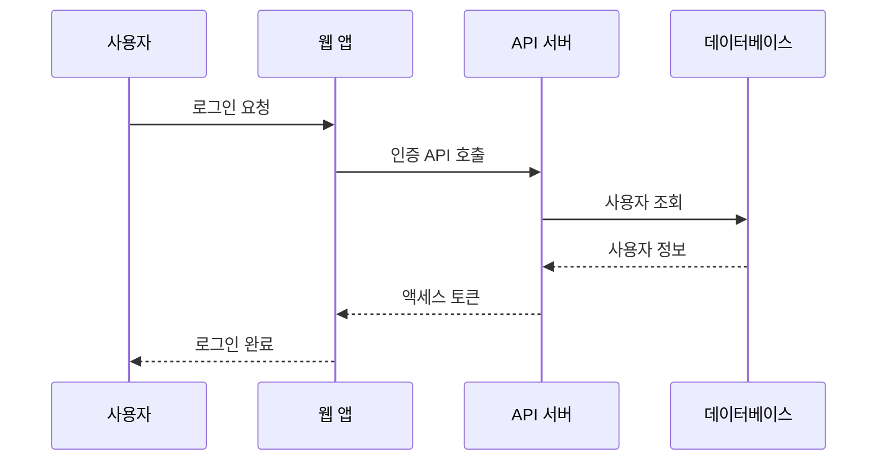

주요 화살표는 다음과 같습니다.

| 문법 | 의미 |
|---|---|
| `A->>B: 메시지` | 요청·동기 호출 |
| `A-->>B: 응답` | 응답 또는 반환 |
| `A-)B: 메시지` | 비동기 메시지 |
| `A--xB: 메시지` | 실패·거절 등 종료를 표현할 때 사용 가능 |

조건과 반복도 표시할 수 있습니다.

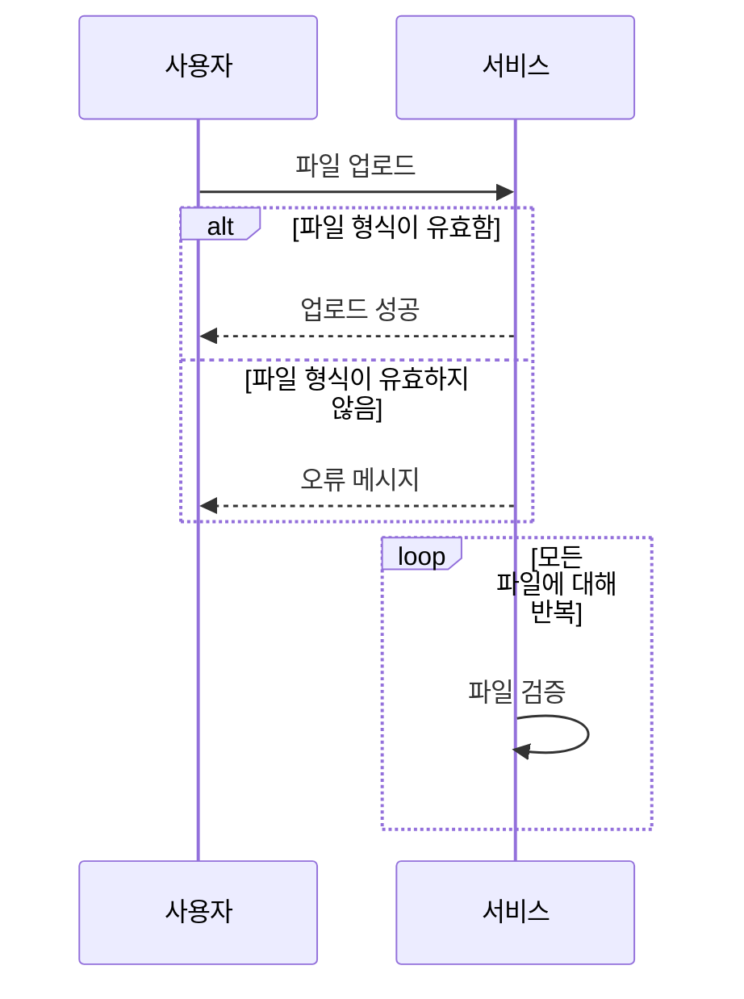

- `alt` / `else` / `end`: 조건 분기
- `opt` / `end`: 선택적 처리
- `loop` / `end`: 반복 처리
- `par` / `and` / `end`: 병렬 처리

---

## 5. 클래스 다이어그램: 객체와 관계

객체지향 설계, 도메인 모델, 주요 데이터 구조를 표현할 때 사용합니다.

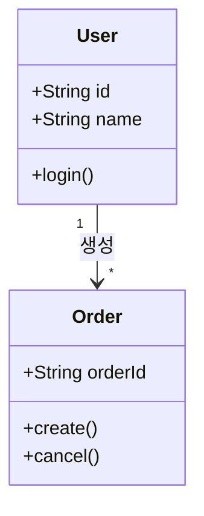

대표 관계 표기:

| 문법 | 관계 |
|---|---|
| `A --> B` | 연관 관계 |
| `A <|-- B` | 상속: B가 A를 상속 |
| `A *-- B` | 합성: A가 B를 강하게 소유 |
| `A o-- B` | 집합: A가 B를 포함 |
| `A ..> B` | 의존 관계 |
| `A ..|> B` | 인터페이스 구현 |

관계선을 지나치게 많이 넣으면 오히려 읽기 어려워집니다. 문서용 다이어그램이라면 핵심 클래스와 주요 관계만 우선 표시하는 편이 낫습니다.

---

## 6. 상태 다이어그램: 상태 전이

주문, 승인, 배포, 티켓 같은 객체가 어떤 상태를 거치는지 나타냅니다.

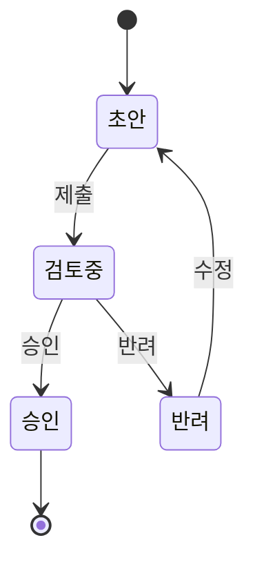

복합 상태도 표현할 수 있습니다.

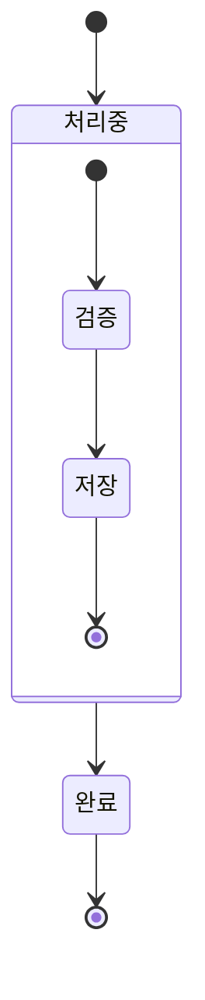

---

## 7. ER 다이어그램: 데이터베이스 엔터티 관계

테이블 구조와 관계를 빠르게 공유할 때 좋습니다.

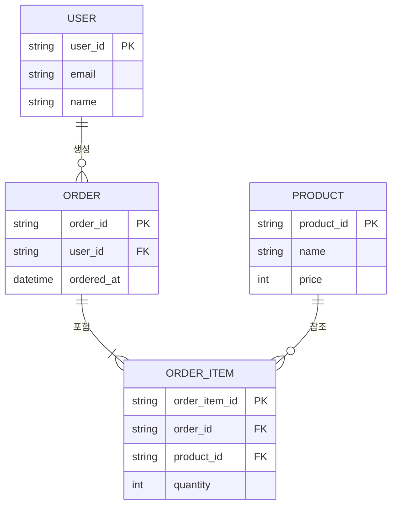

관계 기호의 실무적 해석:

| 표기 | 대략적 의미 |
|---|---|
| `||--||` | 정확히 1 : 정확히 1 |
| `||--o{` | 1 : 0개 이상 |
| `||--|{` | 1 : 1개 이상 |
| `o|--o{` | 0 또는 1 : 0개 이상 |

ERD는 실제 DB 제약 조건과 다를 수 있으므로, 문서에서는 PK·FK·필수 여부를 분명히 하고, 최종 스키마는 마이그레이션 또는 DDL을 기준으로 검증하는 것이 안전합니다.

---

## 8. 간트 차트: 일정과 작업 계획

프로젝트 일정, 배포 계획, 작업 의존성을 보여 줄 때 사용합니다.

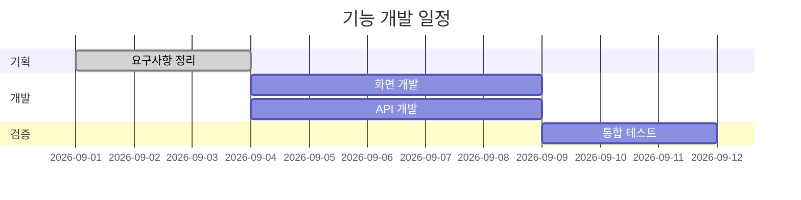

주요 요소:

- `title`: 차트 제목
- `dateFormat`: 날짜 형식
- `section`: 작업 묶음
- `:done`: 완료된 작업
- `after 작업ID`: 선행 작업 이후 시작
- `3d`: 3일간 지속

간트 차트는 일정의 “계획”을 보이는 데 유용하며, 실제 진행 현황과 자동 연동되지는 않습니다. 최신 상태를 유지하려면 문서 갱신 책임자를 정하는 편이 좋습니다.

---

## 9. 파이 차트와 마인드맵

### 파이 차트

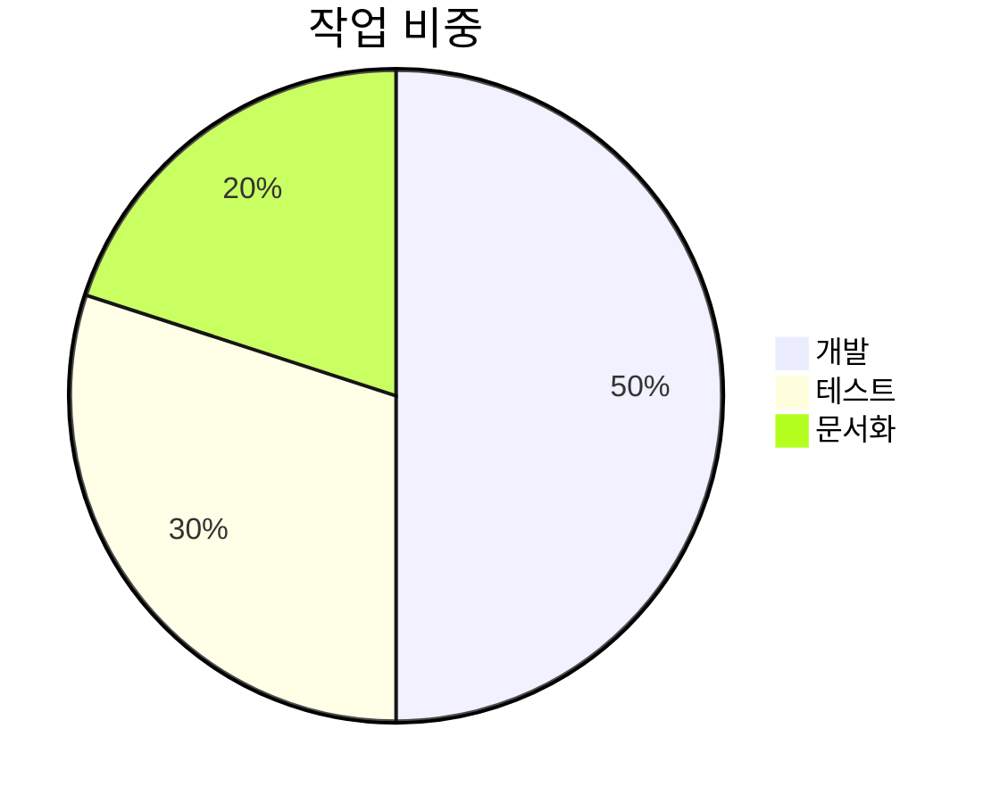

### 마인드맵

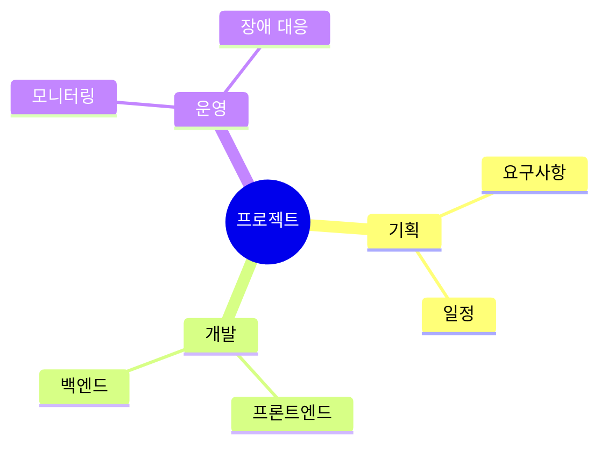

파이 차트는 구성비, 마인드맵은 아이디어 구조화에 적합합니다. 다만 마인드맵 등 일부 유형은 Markdown 플랫폼이나 Mermaid 버전에 따라 지원 수준이 다를 수 있습니다.

---

## 10. Git 그래프

브랜치와 커밋 흐름을 문서화할 때 사용할 수 있습니다.

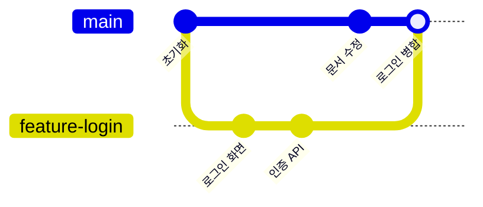

이는 앞서 설명한 Git의 branch와 commit 관계를 시각적으로 보여 주는 데 좋습니다. 실제 저장소의 Git 기록을 자동으로 읽는 것이 아니라, 문서 안에 작성한 내용을 그림으로 만드는 방식입니다.

---

## 11. 스타일 지정

기본 스타일만으로도 충분한 경우가 많지만, 중요 단계·성공·실패 상태를 구분하고 싶으면 스타일을 추가할 수 있습니다.

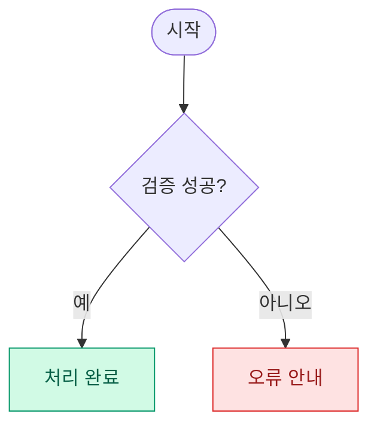

- `classDef`: 재사용할 스타일 정의
- `class`: 특정 노드에 스타일 적용
- 색상만으로 의미를 전달하지 말고, 노드의 텍스트·선 라벨도 명확히 작성하는 것이 좋습니다.

간단하게 개별 스타일을 적용할 수도 있습니다.


하지만 스타일을 과도하게 쓰면 문서 전체의 일관성이 깨지고 다이어그램 유지보수가 어려워질 수 있습니다.

---

## 12. 설정: 테마와 초기화 지시문

다이어그램 맨 앞에 초기화 지시문을 넣어 테마 등을 조정할 수 있습니다.

````markdown
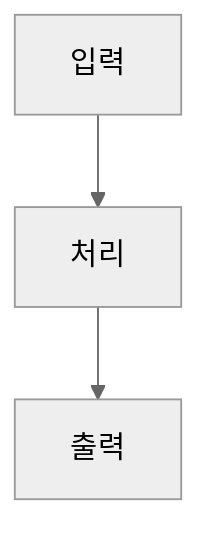
````

예를 들어 `default`, `dark`, `forest`, `neutral` 등의 테마를 사용할 수 있습니다. 단, 지원 테마와 세부 설정은 렌더러가 포함한 Mermaid 버전에 영향을 받습니다.

---

## 13. 실무에서 추천하는 작성 절차

1. **문서 목적을 먼저 결정합니다.**  
   처리 절차면 흐름도, 요청·응답 순서면 시퀀스, 데이터 구조면 ERD, 일정이면 간트 차트가 적합합니다.

2. **한 다이어그램에는 하나의 질문만 담습니다.**  
   예: “로그인 처리 흐름”, “주문 테이블 관계”, “배포 승인 절차”처럼 범위를 좁힙니다.

3. **노드 ID와 표시 문구를 분리합니다.**  
   `AUTH_CHECK{인증 정보가 유효한가?}`처럼 ID는 영어·간결하게, 라벨은 읽기 쉬운 한국어 문장으로 작성하면 유지보수에 유리합니다.

4. **정상 흐름을 먼저 작성합니다.**  
   그 후 예외, 재시도, 실패, 외부 시스템 의존성을 추가합니다.

5. **렌더링 환경에서 즉시 미리 봅니다.**  
   문법 오류는 대개 노드 라벨의 특수문자, 잘못된 들여쓰기, 괄호 짝, 지원하지 않는 문법에서 발생합니다.

6. **다이어그램을 작게 유지합니다.**  
   노드가 많아져 한 화면에서 파악하기 어려워지면 상위 흐름도와 상세 흐름도로 나누는 편이 좋습니다.

---

## 14. 자주 발생하는 문제와 해결

### 다이어그램이 코드로만 보임

**원인:** 현재 Markdown 뷰어가 Mermaid 렌더링을 지원하지 않습니다.  
**대응:** Mermaid 지원 플랫폼에서 열거나, 해당 편집기의 Mermaid 미리보기 기능 또는 확장을 사용합니다.

### 파싱 오류가 남

**자주 있는 원인**

- 노드 라벨에 괄호, 따옴표, 콜론, 대괄호 같은 특수문자가 복잡하게 섞임
- 노드 ID에 공백·특수문자를 사용함
- Mermaid 버전이 낮아 최신 다이어그램 유형을 지원하지 않음
- 화살표·괄호·`end`의 짝이 맞지 않음

**안전한 작성 방식**

```mermaid
flowchart TD
    CHECK{검증 통과 여부}
    SUCCESS[처리 완료]
    FAILURE[오류 처리]

    CHECK -->|통과| SUCCESS
    CHECK -->|실패| FAILURE
```

- ID는 `CHECK`, `SUCCESS`, `FAILURE`처럼 영문·숫자·밑줄 중심으로 둡니다.
- 표시 문구는 `[]`, `{}`, `()` 내부에 작성합니다.
- 복잡한 문구나 특수문자가 많다면 먼저 짧은 문구로 렌더링을 확인합니다.

### 다이어그램이 너무 복잡함

- 하나의 그림에 모든 시스템·예외·세부 구현을 넣지 않습니다.
- 상위 아키텍처, 기능 흐름, 예외 흐름을 별도 다이어그램으로 나눕니다.
- 선이 교차한다면 방향을 바꾸거나 `subgraph`로 영역을 분리합니다.
- 노드보다 **관계와 의사결정**이 읽히도록 정리합니다.

---

## 15. 바로 복사해 쓸 수 있는 업무 프로세스 템플릿

```mermaid
flowchart TD
    START([시작]) --> INPUT[요청 또는 데이터 수신]
    INPUT --> VALIDATE{유효성 검증}

    VALIDATE -->|성공| PROCESS[업무 처리]
    VALIDATE -->|실패| ERROR[오류 또는 보완 요청]

    PROCESS --> SAVE[(결과 저장)]
    SAVE --> NOTIFY[결과 알림]
    NOTIFY --> END([종료])

    ERROR --> END
```

문서에서 다이어그램을 잘 활용하려면 “예쁘게 그리는 것”보다 **누가 무엇을 판단하고, 어떤 조건에서 다음 단계로 가며, 실패하면 어디로 돌아가는지**를 명확하게 만드는 것이 핵심입니다.