 # 【 DataAnalysis Basic 】 

 ## Pandas (DataFrame Library) 

 ○ Pandas Libarary 실행 


```python
import pandas as pd
```

 ○ Data Load (데이터불러오기) 


```python
# 데이터 파일 또는 URL-File에서 불러오기
df = pd.read_csv("https://raw.githubusercontent.com/kimds929/kimds929.github.io/master/_data/test_df.csv")
df
```


<div>
<style scoped>
    .dataframe tbody tr th:only-of-type {
        vertical-align: middle;
    }

    .dataframe tbody tr th {
        vertical-align: top;
    }

    .dataframe thead th {
        text-align: right;
    }
</style>
<table border="1" class="dataframe">
  <thead>
    <tr style="text-align: right;">
      <th></th>
      <th>y</th>
      <th>x1</th>
      <th>x2</th>
      <th>x3</th>
      <th>x4</th>
    </tr>
  </thead>
  <tbody>
    <tr>
      <th>0</th>
      <td>10</td>
      <td>2</td>
      <td>a</td>
      <td>10</td>
      <td>g1</td>
    </tr>
    <tr>
      <th>1</th>
      <td>13</td>
      <td>4</td>
      <td>a</td>
      <td>8</td>
      <td>g2</td>
    </tr>
    <tr>
      <th>2</th>
      <td>20</td>
      <td>5</td>
      <td>b</td>
      <td>5</td>
      <td>g1</td>
    </tr>
    <tr>
      <th>3</th>
      <td>7</td>
      <td>2</td>
      <td>b</td>
      <td>12</td>
      <td>g2</td>
    </tr>
    <tr>
      <th>4</th>
      <td>15</td>
      <td>4</td>
      <td>b</td>
      <td>7</td>
      <td>g3</td>
    </tr>
  </tbody>
</table>
</div>


```python
# 데이터 클립보드에서 불러오기
# df = pd.read_clipboard()
df
```


<div>
<style scoped>
    .dataframe tbody tr th:only-of-type {
        vertical-align: middle;
    }

    .dataframe tbody tr th {
        vertical-align: top;
    }

    .dataframe thead th {
        text-align: right;
    }
</style>
<table border="1" class="dataframe">
  <thead>
    <tr style="text-align: right;">
      <th></th>
      <th>y</th>
      <th>x1</th>
      <th>x2</th>
      <th>x3</th>
      <th>x4</th>
    </tr>
  </thead>
  <tbody>
    <tr>
      <th>0</th>
      <td>10</td>
      <td>2</td>
      <td>a</td>
      <td>10</td>
      <td>g1</td>
    </tr>
    <tr>
      <th>1</th>
      <td>13</td>
      <td>4</td>
      <td>a</td>
      <td>8</td>
      <td>g2</td>
    </tr>
    <tr>
      <th>2</th>
      <td>20</td>
      <td>5</td>
      <td>b</td>
      <td>5</td>
      <td>g1</td>
    </tr>
    <tr>
      <th>3</th>
      <td>7</td>
      <td>2</td>
      <td>b</td>
      <td>12</td>
      <td>g2</td>
    </tr>
    <tr>
      <th>4</th>
      <td>15</td>
      <td>4</td>
      <td>b</td>
      <td>7</td>
      <td>g3</td>
    </tr>
  </tbody>
</table>
</div>


```python
# 직접입력 Data로부터 만들기
test_dict = {'y': [10, 13, 20, 7, 15],
            'x1': [2, 4, 5, 2, 4],
            'x2': ['a', 'a', 'b', 'b', 'b'],
            'x3': [10, 8, 5, 12, 7],
            'x4': ['g1', 'g2', 'g1', 'g2', 'g3']}

df = pd.DataFrame(test_dict)
df

```


<div>
<style scoped>
    .dataframe tbody tr th:only-of-type {
        vertical-align: middle;
    }

    .dataframe tbody tr th {
        vertical-align: top;
    }

    .dataframe thead th {
        text-align: right;
    }
</style>
<table border="1" class="dataframe">
  <thead>
    <tr style="text-align: right;">
      <th></th>
      <th>y</th>
      <th>x1</th>
      <th>x2</th>
      <th>x3</th>
      <th>x4</th>
    </tr>
  </thead>
  <tbody>
    <tr>
      <th>0</th>
      <td>10</td>
      <td>2</td>
      <td>a</td>
      <td>10</td>
      <td>g1</td>
    </tr>
    <tr>
      <th>1</th>
      <td>13</td>
      <td>4</td>
      <td>a</td>
      <td>8</td>
      <td>g2</td>
    </tr>
    <tr>
      <th>2</th>
      <td>20</td>
      <td>5</td>
      <td>b</td>
      <td>5</td>
      <td>g1</td>
    </tr>
    <tr>
      <th>3</th>
      <td>7</td>
      <td>2</td>
      <td>b</td>
      <td>12</td>
      <td>g2</td>
    </tr>
    <tr>
      <th>4</th>
      <td>15</td>
      <td>4</td>
      <td>b</td>
      <td>7</td>
      <td>g3</td>
    </tr>
  </tbody>
</table>
</div>


```python
# 데이터 클립보드로 내보내기
df.to_clipboard()


```

 ○ Display & Indexing (데이터 확인 & 인덱싱) 


```python
df      # 데이터보기
```


<div>
<style scoped>
    .dataframe tbody tr th:only-of-type {
        vertical-align: middle;
    }

    .dataframe tbody tr th {
        vertical-align: top;
    }

    .dataframe thead th {
        text-align: right;
    }
</style>
<table border="1" class="dataframe">
  <thead>
    <tr style="text-align: right;">
      <th></th>
      <th>y</th>
      <th>x1</th>
      <th>x2</th>
      <th>x3</th>
      <th>x4</th>
    </tr>
  </thead>
  <tbody>
    <tr>
      <th>0</th>
      <td>10</td>
      <td>2</td>
      <td>a</td>
      <td>10</td>
      <td>g1</td>
    </tr>
    <tr>
      <th>1</th>
      <td>13</td>
      <td>4</td>
      <td>a</td>
      <td>8</td>
      <td>g2</td>
    </tr>
    <tr>
      <th>2</th>
      <td>20</td>
      <td>5</td>
      <td>b</td>
      <td>5</td>
      <td>g1</td>
    </tr>
    <tr>
      <th>3</th>
      <td>7</td>
      <td>2</td>
      <td>b</td>
      <td>12</td>
      <td>g2</td>
    </tr>
    <tr>
      <th>4</th>
      <td>15</td>
      <td>4</td>
      <td>b</td>
      <td>7</td>
      <td>g3</td>
    </tr>
  </tbody>
</table>
</div>


```python
df.sample(3)      # 데이터보기 (3개만보기)
```


<div>
<style scoped>
    .dataframe tbody tr th:only-of-type {
        vertical-align: middle;
    }

    .dataframe tbody tr th {
        vertical-align: top;
    }

    .dataframe thead th {
        text-align: right;
    }
</style>
<table border="1" class="dataframe">
  <thead>
    <tr style="text-align: right;">
      <th></th>
      <th>y</th>
      <th>x1</th>
      <th>x2</th>
      <th>x3</th>
      <th>x4</th>
    </tr>
  </thead>
  <tbody>
    <tr>
      <th>4</th>
      <td>15</td>
      <td>4</td>
      <td>b</td>
      <td>7</td>
      <td>g3</td>
    </tr>
    <tr>
      <th>3</th>
      <td>7</td>
      <td>2</td>
      <td>b</td>
      <td>12</td>
      <td>g2</td>
    </tr>
    <tr>
      <th>2</th>
      <td>20</td>
      <td>5</td>
      <td>b</td>
      <td>5</td>
      <td>g1</td>
    </tr>
  </tbody>
</table>
</div>


```python
# 1개 Colum 선택하기 (select, indexing)
df['x1']                # 1개만 선택 (Series)
```


    0    2
    1    4
    2    5
    3    2
    4    4
    Name: x1, dtype: int64


```python
# 2개이상 Colum 선택하기 (select, indexing)
df[['x1', 'x2']]        # 2개이상 선택 (DataFrame)
```


<div>
<style scoped>
    .dataframe tbody tr th:only-of-type {
        vertical-align: middle;
    }

    .dataframe tbody tr th {
        vertical-align: top;
    }

    .dataframe thead th {
        text-align: right;
    }
</style>
<table border="1" class="dataframe">
  <thead>
    <tr style="text-align: right;">
      <th></th>
      <th>x1</th>
      <th>x2</th>
    </tr>
  </thead>
  <tbody>
    <tr>
      <th>0</th>
      <td>2</td>
      <td>a</td>
    </tr>
    <tr>
      <th>1</th>
      <td>4</td>
      <td>a</td>
    </tr>
    <tr>
      <th>2</th>
      <td>5</td>
      <td>b</td>
    </tr>
    <tr>
      <th>3</th>
      <td>2</td>
      <td>b</td>
    </tr>
    <tr>
      <th>4</th>
      <td>4</td>
      <td>b</td>
    </tr>
  </tbody>
</table>
</div>


```python
# 1개이상 Colum을 DataFrame형태로 선택하기 (select, indexing)
df[['x1']]        # 1개를 DataFrame 형태로 선택 (DataFrame)

```


<div>
<style scoped>
    .dataframe tbody tr th:only-of-type {
        vertical-align: middle;
    }

    .dataframe tbody tr th {
        vertical-align: top;
    }

    .dataframe thead th {
        text-align: right;
    }
</style>
<table border="1" class="dataframe">
  <thead>
    <tr style="text-align: right;">
      <th></th>
      <th>x1</th>
    </tr>
  </thead>
  <tbody>
    <tr>
      <th>0</th>
      <td>2</td>
    </tr>
    <tr>
      <th>1</th>
      <td>4</td>
    </tr>
    <tr>
      <th>2</th>
      <td>5</td>
    </tr>
    <tr>
      <th>3</th>
      <td>2</td>
    </tr>
    <tr>
      <th>4</th>
      <td>4</td>
    </tr>
  </tbody>
</table>
</div>


 **※ (참고) 기능어 역할** </br>
&nbsp; □.□ : 앞의 대상에 어떤 함수를 사용하거나, 변수를 불러올때 사용 </br>
&nbsp;&nbsp;&nbsp;   pd.read_csv(...) → pandas Library에서  read_csv 함수를 사용 </br>
    </br>
&nbsp; □() : 함수( input → 함수 → output) </br>
&nbsp;&nbsp;&nbsp;   pd.read_csv(...) → pandas Library에서  read_csv함수를 사용하는데 ...이라는 경로에서 불러올 예정 </br>
    </br>
&nbsp; □[] : 대상에 접근, Item추출 </br>
&nbsp;&nbsp;&nbsp;   df['x1'] → df라는 데이터프레임에서 'x1' column에 접근하여 데이터를 추출 </br>
</br>
</br>

 ○ Filtering (필터링) 


```python
# 'equal' filtering
df[df['x2'] == 'a']
```


<div>
<style scoped>
    .dataframe tbody tr th:only-of-type {
        vertical-align: middle;
    }

    .dataframe tbody tr th {
        vertical-align: top;
    }

    .dataframe thead th {
        text-align: right;
    }
</style>
<table border="1" class="dataframe">
  <thead>
    <tr style="text-align: right;">
      <th></th>
      <th>y</th>
      <th>x1</th>
      <th>x2</th>
      <th>x3</th>
      <th>x4</th>
    </tr>
  </thead>
  <tbody>
    <tr>
      <th>0</th>
      <td>10</td>
      <td>2</td>
      <td>a</td>
      <td>10</td>
      <td>g1</td>
    </tr>
    <tr>
      <th>1</th>
      <td>13</td>
      <td>4</td>
      <td>a</td>
      <td>8</td>
      <td>g2</td>
    </tr>
  </tbody>
</table>
</div>


```python
# 'not equal' filtering
df[df['x2'] != 'a']
```


<div>
<style scoped>
    .dataframe tbody tr th:only-of-type {
        vertical-align: middle;
    }

    .dataframe tbody tr th {
        vertical-align: top;
    }

    .dataframe thead th {
        text-align: right;
    }
</style>
<table border="1" class="dataframe">
  <thead>
    <tr style="text-align: right;">
      <th></th>
      <th>y</th>
      <th>x1</th>
      <th>x2</th>
      <th>x3</th>
      <th>x4</th>
    </tr>
  </thead>
  <tbody>
    <tr>
      <th>2</th>
      <td>20</td>
      <td>5</td>
      <td>b</td>
      <td>5</td>
      <td>g1</td>
    </tr>
    <tr>
      <th>3</th>
      <td>7</td>
      <td>2</td>
      <td>b</td>
      <td>12</td>
      <td>g2</td>
    </tr>
    <tr>
      <th>4</th>
      <td>15</td>
      <td>4</td>
      <td>b</td>
      <td>7</td>
      <td>g3</td>
    </tr>
  </tbody>
</table>
</div>


```python
# 'inequality' filtering
df[df['y'] > 10]
```


<div>
<style scoped>
    .dataframe tbody tr th:only-of-type {
        vertical-align: middle;
    }

    .dataframe tbody tr th {
        vertical-align: top;
    }

    .dataframe thead th {
        text-align: right;
    }
</style>
<table border="1" class="dataframe">
  <thead>
    <tr style="text-align: right;">
      <th></th>
      <th>y</th>
      <th>x1</th>
      <th>x2</th>
      <th>x3</th>
      <th>x4</th>
    </tr>
  </thead>
  <tbody>
    <tr>
      <th>1</th>
      <td>13</td>
      <td>4</td>
      <td>a</td>
      <td>8</td>
      <td>g2</td>
    </tr>
    <tr>
      <th>2</th>
      <td>20</td>
      <td>5</td>
      <td>b</td>
      <td>5</td>
      <td>g1</td>
    </tr>
    <tr>
      <th>4</th>
      <td>15</td>
      <td>4</td>
      <td>b</td>
      <td>7</td>
      <td>g3</td>
    </tr>
  </tbody>
</table>
</div>


```python
# filtering → select 'x2'
df[df['x2'] == 'a']['x2']       # 필터링 후 특정 column선택

```


    0    a
    1    a
    Name: x2, dtype: object


 ○ Operation (연산) 


```python
# 'x1' column select
df['x1']
```


    0    2
    1    4
    2    5
    3    2
    4    4
    Name: x1, dtype: int64


```python
# 갯수
df['x1'].count()
```


    5


```python
# 합계
df['x1'].sum()
```


    17


```python
# 평균
df['x1'].mean()
```


    3.4


```python
# 편차
df['x1'].std()
```


    1.3416407864998738


```python
# 합계함수로 평균값 구하기
df['x1'].agg('mean')
```


    3.4


```python
# 합계함수로 여러개의 통계값(갯수, 평균, 편차) 한꺼번에 구하기
df['x1'].agg(['count', 'mean', 'std'])
```


    count    5.000000
    mean     3.400000
    std      1.341641
    Name: x1, dtype: float64


 ○ groupby (Pivot) 


```python
# 'x2'로 grouping 후 전체 Column에 대한 합계
df.groupby('x2').sum()
```


<div>
<style scoped>
    .dataframe tbody tr th:only-of-type {
        vertical-align: middle;
    }

    .dataframe tbody tr th {
        vertical-align: top;
    }

    .dataframe thead th {
        text-align: right;
    }
</style>
<table border="1" class="dataframe">
  <thead>
    <tr style="text-align: right;">
      <th></th>
      <th>y</th>
      <th>x1</th>
      <th>x3</th>
    </tr>
    <tr>
      <th>x2</th>
      <th></th>
      <th></th>
      <th></th>
    </tr>
  </thead>
  <tbody>
    <tr>
      <th>a</th>
      <td>23</td>
      <td>6</td>
      <td>18</td>
    </tr>
    <tr>
      <th>b</th>
      <td>42</td>
      <td>11</td>
      <td>24</td>
    </tr>
  </tbody>
</table>
</div>


```python
# 'x2'로 grouping 후 'x1'column에 대한 합계
df.groupby('x2')['x1'].sum()
```


    x2
    a     6
    b    11
    Name: x1, dtype: int64


```python
# 'x2, x4' 로 grouping 후 'x1'column에 대한 합계
df.groupby(['x2','x4'])['x1'].sum()
```


    x2  x4
    a   g1    2
        g2    4
    b   g1    5
        g2    2
        g3    4
    Name: x1, dtype: int64


```python
# 'x2, x4' 로 grouping 후 'x1'column에 대한 통계값(갯수, 평균, 편차)
df.groupby(['x2','x4'])['x1'].agg(['count','mean','std'])

```


<div>
<style scoped>
    .dataframe tbody tr th:only-of-type {
        vertical-align: middle;
    }

    .dataframe tbody tr th {
        vertical-align: top;
    }

    .dataframe thead th {
        text-align: right;
    }
</style>
<table border="1" class="dataframe">
  <thead>
    <tr style="text-align: right;">
      <th></th>
      <th></th>
      <th>count</th>
      <th>mean</th>
      <th>std</th>
    </tr>
    <tr>
      <th>x2</th>
      <th>x4</th>
      <th></th>
      <th></th>
      <th></th>
    </tr>
  </thead>
  <tbody>
    <tr>
      <th rowspan="2" valign="top">a</th>
      <th>g1</th>
      <td>1</td>
      <td>2</td>
      <td>NaN</td>
    </tr>
    <tr>
      <th>g2</th>
      <td>1</td>
      <td>4</td>
      <td>NaN</td>
    </tr>
    <tr>
      <th rowspan="3" valign="top">b</th>
      <th>g1</th>
      <td>1</td>
      <td>5</td>
      <td>NaN</td>
    </tr>
    <tr>
      <th>g2</th>
      <td>1</td>
      <td>2</td>
      <td>NaN</td>
    </tr>
    <tr>
      <th>g3</th>
      <td>1</td>
      <td>4</td>
      <td>NaN</td>
    </tr>
  </tbody>
</table>
</div>


</br>
</br>
</br>
</br>
</br>

 ## Matplotlib.pyplot & Seaborn (Graph Library) 

 ○ matplotlib, seaborn Libarary 실행 


```python
import matplotlib.pyplot as plt
import seaborn as sns
```


```python
# data 확인
df

```


<div>
<style scoped>
    .dataframe tbody tr th:only-of-type {
        vertical-align: middle;
    }

    .dataframe tbody tr th {
        vertical-align: top;
    }

    .dataframe thead th {
        text-align: right;
    }
</style>
<table border="1" class="dataframe">
  <thead>
    <tr style="text-align: right;">
      <th></th>
      <th>y</th>
      <th>x1</th>
      <th>x2</th>
      <th>x3</th>
      <th>x4</th>
    </tr>
  </thead>
  <tbody>
    <tr>
      <th>0</th>
      <td>10</td>
      <td>2</td>
      <td>a</td>
      <td>10</td>
      <td>g1</td>
    </tr>
    <tr>
      <th>1</th>
      <td>13</td>
      <td>4</td>
      <td>a</td>
      <td>8</td>
      <td>g2</td>
    </tr>
    <tr>
      <th>2</th>
      <td>20</td>
      <td>5</td>
      <td>b</td>
      <td>5</td>
      <td>g1</td>
    </tr>
    <tr>
      <th>3</th>
      <td>7</td>
      <td>2</td>
      <td>b</td>
      <td>12</td>
      <td>g2</td>
    </tr>
    <tr>
      <th>4</th>
      <td>15</td>
      <td>4</td>
      <td>b</td>
      <td>7</td>
      <td>g3</td>
    </tr>
  </tbody>
</table>
</div>


 ○ Draw Graph 


```python
# histogram
plt.hist(x=df['x1'])      # histogram
```


    (array([2., 0., 0., 0., 0., 0., 2., 0., 0., 1.]),
     array([2. , 2.3, 2.6, 2.9, 3.2, 3.5, 3.8, 4.1, 4.4, 4.7, 5. ]),
     <BarContainer object of 10 artists>)


    

    


```python
# scatter-plot
plt.scatter(x=df['x1'], y=df['y'])      # scatter plot
```


    <matplotlib.collections.PathCollection at 0xa7f01c0>


    

    


```python
# line-plot
plt.plot(df['x1'], df['y'])      # Line Plot
```


    [<matplotlib.lines.Line2D at 0xa82bf40>]


    
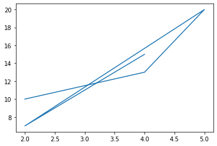
    


```python
# boxplot (seaborn)
sns.boxplot(data=df, x='x2', y='x1')    # boxplot (seaborn)
```


    <AxesSubplot:xlabel='x2', ylabel='x1'>


    
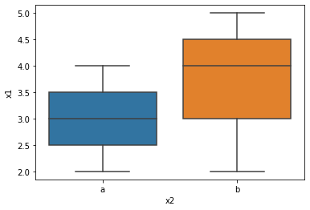
    


```python
# boxplot (pyplot)
box1 = df[df['x2'] == 'a']['x1']
box2 = df[df['x2'] != 'a']['x1']
plt.boxplot([box1, box2], labels=['Class_1', 'Class_2'])        # boxplot (pyplot)
```


    {'whiskers': [<matplotlib.lines.Line2D at 0xa8c8160>,
      <matplotlib.lines.Line2D at 0xa8c8310>,
      <matplotlib.lines.Line2D at 0xa8c8d30>,
      <matplotlib.lines.Line2D at 0xa8c8ee0>],
     'caps': [<matplotlib.lines.Line2D at 0xa8c84c0>,
      <matplotlib.lines.Line2D at 0xa8c8670>,
      <matplotlib.lines.Line2D at 0xa8d60b8>,
      <matplotlib.lines.Line2D at 0xa8d6268>],
     'boxes': [<matplotlib.lines.Line2D at 0xa8b8f70>,
      <matplotlib.lines.Line2D at 0xa8c8b80>],
     'medians': [<matplotlib.lines.Line2D at 0xa8c8820>,
      <matplotlib.lines.Line2D at 0xa8d6418>],
     'fliers': [<matplotlib.lines.Line2D at 0xa8c89d0>,
      <matplotlib.lines.Line2D at 0xa8d65c8>],
     'means': []}


    
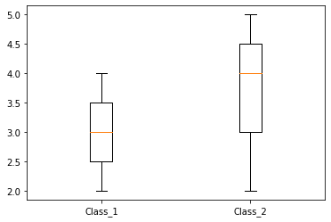
    


 ○ Draw Option 


```python
plt.hist(x=df['x1'], bins=30)      # 막대 갯수
```


    (array([2., 0., 0., 0., 0., 0., 0., 0., 0., 0., 0., 0., 0., 0., 0., 0., 0.,
            0., 0., 0., 2., 0., 0., 0., 0., 0., 0., 0., 0., 1.]),
     array([2. , 2.1, 2.2, 2.3, 2.4, 2.5, 2.6, 2.7, 2.8, 2.9, 3. , 3.1, 3.2,
            3.3, 3.4, 3.5, 3.6, 3.7, 3.8, 3.9, 4. , 4.1, 4.2, 4.3, 4.4, 4.5,
            4.6, 4.7, 4.8, 4.9, 5. ]),
     <BarContainer object of 30 artists>)


    
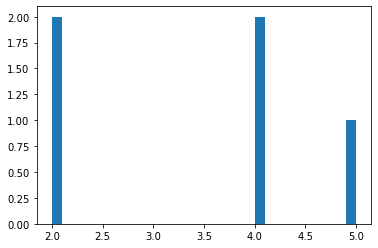
    


```python
plt.hist(x=df['x1'], color='skyblue')      # 채우기색
```


    (array([2., 0., 0., 0., 0., 0., 2., 0., 0., 1.]),
     array([2. , 2.3, 2.6, 2.9, 3.2, 3.5, 3.8, 4.1, 4.4, 4.7, 5. ]),
     <BarContainer object of 10 artists>)


    
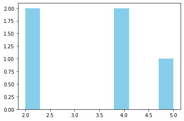
    


```python
plt.hist(x=df['x1'], color='skyblue', edgecolor='grey')      # 외곽선
```


    (array([2., 0., 0., 0., 0., 0., 2., 0., 0., 1.]),
     array([2. , 2.3, 2.6, 2.9, 3.2, 3.5, 3.8, 4.1, 4.4, 4.7, 5. ]),
     <BarContainer object of 10 artists>)


    

    


```python
plt.hist(x=df['x1'], color='skyblue', edgecolor='grey', alpha=0.1)      # 투명도
```


    (array([2., 0., 0., 0., 0., 0., 2., 0., 0., 1.]),
     array([2. , 2.3, 2.6, 2.9, 3.2, 3.5, 3.8, 4.1, 4.4, 4.7, 5. ]),
     <BarContainer object of 10 artists>)


    
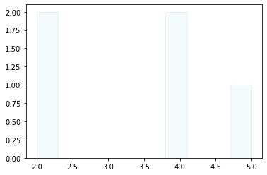
    


```python
plt.scatter(x=df['x1'], y=df['y'], color='orange')      # 채우기색
```


    <matplotlib.collections.PathCollection at 0xaa38c70>


    
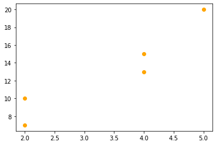
    


```python
plt.scatter(x=df['x1'], y=df['y'], color='orange', edgecolor='blue')      # 외곽선
```


    <matplotlib.collections.PathCollection at 0xa7d84c0>


    
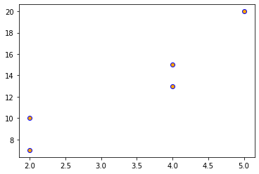
    


```python
plt.scatter(x=df['x1'], y=df['y'], color='orange', edgecolor='blue', alpha=0.1)      # 투명도

```


    <matplotlib.collections.PathCollection at 0xaa1f598>


    

    


```python
# Histogram with Normal Distribution Curve
from scipy import stats
sns.distplot(df['x1'], fit=stats.norm, kde=False)


```

    C:\Users\Admin\Anaconda3\lib\site-packages\seaborn\distributions.py:2551: FutureWarning: `distplot` is a deprecated function and will be removed in a future version. Please adapt your code to use either `displot` (a figure-level function with similar flexibility) or `histplot` (an axes-level function for histograms).
      warnings.warn(msg, FutureWarning)
    


    <AxesSubplot:xlabel='x1'>


    
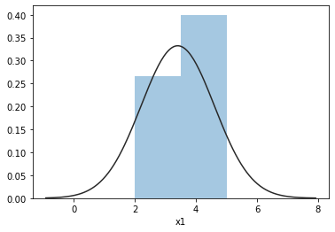
    


 ○ Graph Draw Full Code


```python
# 다중줄수행 및 기타 옵션 
plt.figure()                    # Canvas 그리기
plt.hist(x=df['x1'])            # Histogram
plt.axvline(3, color='red', ls='dashed', alpha=0.7)      # Vertical Line
plt.show()                      # plot 그리기의 종료(plt.show(), plot.close())
```


    
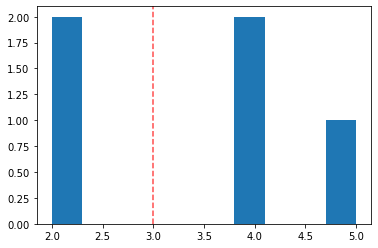
    


```python
# Figure의 변수 저장 (plt.show)
f = plt.figure()
plt.hist(x=df['x1'])
plt.axhline(1.5, color='orange', ls='dashed', alpha=0.7)      # Horizontal Line
plt.show()
```


    

    


```python
f
```


    

    


```python
# Figure의 변수 저장 (plt.close)
f = plt.figure()
plt.hist(x=df['x1'])
plt.axhline(1.5, color='orange', ls='dashed', alpha=0.7)      # Horizontal Line
plt.close()
```


```python
f
```


    

    


</br>
</br>
</br>
</br>
</br>

 ## Scipy (Statistics) 

 ○ Scipy Libarary 실행 """
from scipy import stats


```python
df

```


<div>
<style scoped>
    .dataframe tbody tr th:only-of-type {
        vertical-align: middle;
    }

    .dataframe tbody tr th {
        vertical-align: top;
    }

    .dataframe thead th {
        text-align: right;
    }
</style>
<table border="1" class="dataframe">
  <thead>
    <tr style="text-align: right;">
      <th></th>
      <th>y</th>
      <th>x1</th>
      <th>x2</th>
      <th>x3</th>
      <th>x4</th>
    </tr>
  </thead>
  <tbody>
    <tr>
      <th>0</th>
      <td>10</td>
      <td>2</td>
      <td>a</td>
      <td>10</td>
      <td>g1</td>
    </tr>
    <tr>
      <th>1</th>
      <td>13</td>
      <td>4</td>
      <td>a</td>
      <td>8</td>
      <td>g2</td>
    </tr>
    <tr>
      <th>2</th>
      <td>20</td>
      <td>5</td>
      <td>b</td>
      <td>5</td>
      <td>g1</td>
    </tr>
    <tr>
      <th>3</th>
      <td>7</td>
      <td>2</td>
      <td>b</td>
      <td>12</td>
      <td>g2</td>
    </tr>
    <tr>
      <th>4</th>
      <td>15</td>
      <td>4</td>
      <td>b</td>
      <td>7</td>
      <td>g3</td>
    </tr>
  </tbody>
</table>
</div>


 ○ t-test </br>
&nbsp;$nbsp; '두집단의 평균이 같은지?'를 비교하는 모수적 통계방법


```python
df.agg(['mean', 'std'])
```


<div>
<style scoped>
    .dataframe tbody tr th:only-of-type {
        vertical-align: middle;
    }

    .dataframe tbody tr th {
        vertical-align: top;
    }

    .dataframe thead th {
        text-align: right;
    }
</style>
<table border="1" class="dataframe">
  <thead>
    <tr style="text-align: right;">
      <th></th>
      <th>y</th>
      <th>x1</th>
      <th>x3</th>
    </tr>
  </thead>
  <tbody>
    <tr>
      <th>mean</th>
      <td>13.000000</td>
      <td>3.400000</td>
      <td>8.400000</td>
    </tr>
    <tr>
      <th>std</th>
      <td>4.949747</td>
      <td>1.341641</td>
      <td>2.701851</td>
    </tr>
  </tbody>
</table>
</div>


 ○ 1 Sample t 


```python
# 1-sample t
stats.ttest_1samp(df['x1'], 4)   # x1 Column의 평균이 4와 같은가?

```


    Ttest_1sampResult(statistic=-1.0, pvalue=0.373900966300059)


```python
# 1-sample t
stats.ttest_1samp(df['x1'], 6)   # x1 Column의 평균이 6와 같은가?
```


    Ttest_1sampResult(statistic=-4.333333333333333, pvalue=0.012317352470240385)


```python
# # visualization (histogram)
plt.figure()
sns.distplot(df['x1'], bins=3, fit=stats.norm, kde=False, hist=True)
plt.axvline(4, alpha=0.7, ls='dashed', color='orange', label='4')
plt.axvline(6, alpha=0.7, ls='dashed', color='brown', label='6')
plt.legend()
plt.show()

```

    C:\Users\Admin\Anaconda3\lib\site-packages\seaborn\distributions.py:2551: FutureWarning: `distplot` is a deprecated function and will be removed in a future version. Please adapt your code to use either `displot` (a figure-level function with similar flexibility) or `histplot` (an axes-level function for histograms).
      warnings.warn(msg, FutureWarning)
    


    
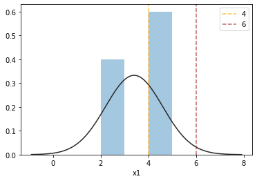
    


 ○ 2 Sample t 


```python
# gruop나누기
t1_data = df[df['x2']=='a']['x1']
t2_data = df[df['x2']=='b']['x1']
```


```python
t1_data
```


    0    2
    1    4
    Name: x1, dtype: int64


```python
t2_data

```


    2    5
    3    2
    4    4
    Name: x1, dtype: int64


```python
df.groupby('x2')['x1'].agg(['mean','std'])
```


<div>
<style scoped>
    .dataframe tbody tr th:only-of-type {
        vertical-align: middle;
    }

    .dataframe tbody tr th {
        vertical-align: top;
    }

    .dataframe thead th {
        text-align: right;
    }
</style>
<table border="1" class="dataframe">
  <thead>
    <tr style="text-align: right;">
      <th></th>
      <th>mean</th>
      <th>std</th>
    </tr>
    <tr>
      <th>x2</th>
      <th></th>
      <th></th>
    </tr>
  </thead>
  <tbody>
    <tr>
      <th>a</th>
      <td>3.000000</td>
      <td>1.414214</td>
    </tr>
    <tr>
      <th>b</th>
      <td>3.666667</td>
      <td>1.527525</td>
    </tr>
  </tbody>
</table>
</div>


```python
# 2-sample t
ttest_ind = stats.ttest_ind(t1_data, t2_data, equal_var=False)      # 두개 그룹의 평균이 같은가?
ttest_ind # 결과 : (t_value, p-value)
```


    Ttest_indResult(statistic=-0.4999999999999999, pvalue=0.6588098059554004)


```python
# visualization (Histogram)
plt.figure()
sns.distplot(t1_data, bins=3, fit=stats.norm, kde=False, hist=True, fit_kws={'color':'steelblue'})
sns.distplot(t2_data, bins=3, fit=stats.norm, kde=False, hist=True, fit_kws={'color':'orange'})
plt.axvline(t1_data.mean(), alpha=0.7, ls='dashed', color='steelblue', label='t1')
plt.axvline(t2_data.mean(), alpha=0.7, ls='dashed', color='orange', label='t2')
plt.legend()
plt.show()
```

    C:\Users\Admin\Anaconda3\lib\site-packages\seaborn\distributions.py:2551: FutureWarning: `distplot` is a deprecated function and will be removed in a future version. Please adapt your code to use either `displot` (a figure-level function with similar flexibility) or `histplot` (an axes-level function for histograms).
      warnings.warn(msg, FutureWarning)
    C:\Users\Admin\Anaconda3\lib\site-packages\seaborn\distributions.py:2551: FutureWarning: `distplot` is a deprecated function and will be removed in a future version. Please adapt your code to use either `displot` (a figure-level function with similar flexibility) or `histplot` (an axes-level function for histograms).
      warnings.warn(msg, FutureWarning)
    


    
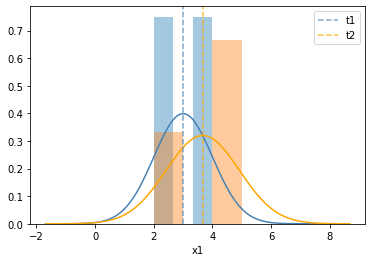
    


```python
# visualization (boxplot)
plt.figure()
plt.boxplot([t1_data, t2_data], showmeans=True, meanprops={'marker':'o', 'markerfacecolor':'red', 'markeredgecolor':'none'})
plt.xticks([1,2], ['t1', 't2'])
plt.show()
```


    

    


```python
# visualization (vertical boxplot)
plt.figure()
plt.boxplot([t1_data, t2_data], vert=False, showmeans=True, meanprops={'marker':'o', 'markerfacecolor':'red', 'markeredgecolor':'none'})
plt.yticks([1,2], ['t1', 't2'])
plt.show()


```


    
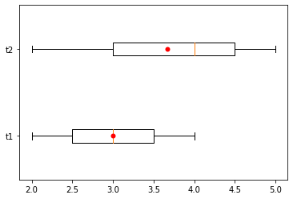
    

